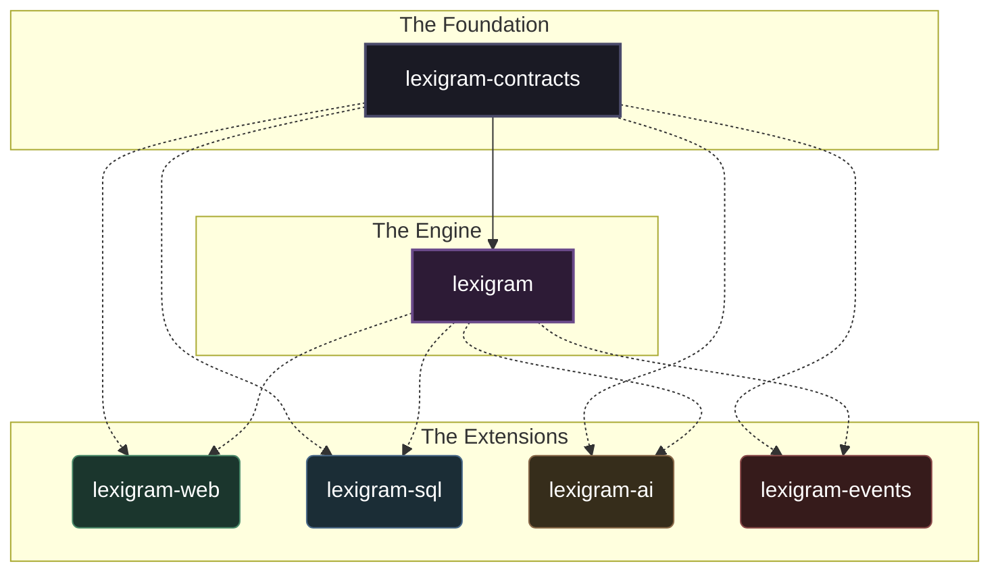

import { Card, CardGrid, LinkCard, TabItem, Tabs } from '@astrojs/starlight/components';
import HeroGraphic from '../../components/HeroGraphic.astro';
import HeroGraphicRAG from '../../components/HeroGraphicRAG.astro';
import HeroGraphicBoot from '../../components/HeroGraphicBoot.astro';

<HeroGraphic />

---

hey — wanna ship an AI app this weekend?

Lexigram is a python framework that hands you Agents, LLMs, RAG, Skills, and memory already wired up — no glue code, no "and then we add the queue," no 200-line config files. The full async backend is right there too: web, sql, cache, auth, queues, events — all wired through one container, all built around one rule. It's async-native, container-managed, and built so the same patterns that get you to a demo on Sunday still hold up when the weekend project turns into the company. Pick a few packages, boot the application, ship the thing.

---

```text
HOOK    agents · llms · rag · skills · memory
CORE    web · sql · cache · auth · queue · events
TRUST   di · contracts · modules · async
```

---

## what it does, in three cards

<div class="three-card-grid">
  <Card title="AI Agents" icon="puzzle">
    An agent class, a few `@tool` methods, pick a strategy — react, plan, or write your own. The container wires the LLM, tools, and trace. You just run it.
  </Card>
  <Card title="RAG" icon="magnifier">
    One `RAGPipeline(...)` call and you have retrieval. Embedders, retrievers, chunkers, rerankers — all swappable through contracts, all wired by the container.
  </Card>
  <Card title="Memory" icon="seti:database">
    Working, episodic, semantic — pick the store, wire the provider. Your agent remembers between turns, across sessions, without you building a cache layer.
  </Card>
</div>

<HeroGraphicRAG />

---

## how it feels to write Lexigram

<Tabs>
<TabItem label="1. declare contracts" icon="list-format">

Say what you need, not who provides it. Contracts live in `lexigram-contracts` so nothing across the rest of the codebase has to know who's on the other end.

```python
from typing import Protocol

class NotificationServiceProtocol(Protocol):
    async def send(self, user_id: str, message: str) -> None:
        """Send a notification to a user."""
```

</TabItem>
<TabItem label="2. write business logic" icon="puzzle">

Constructor injection, no globals. Your IDE gets full type inference, your tests get whatever fake you want to pass in.

```python
from lexigram import injectable

@injectable
class CheckoutService:
    def __init__(self, notifier: NotificationServiceProtocol) -> None:
        self.notifier = notifier

    async def complete_order(self, user_id: str) -> None:
        # Process order...
        await self.notifier.send(user_id, "Order Complete!")
```

</TabItem>
<TabItem label="3. bundle in providers" icon="setting">

A provider is the seam where "what I need" meets "what to use." Group your bindings, set a priority, and the container handles the rest.

```python
from lexigram import Provider, ProviderPriority

class NotificationProvider(Provider):
    name = "notification"
    priority = ProviderPriority.COMMS

    async def register(self, container) -> None:
        # Bind the concrete implementation to the protocol
        container.singleton(NotificationServiceProtocol, SlackNotifier)
```

</TabItem>
<TabItem label="4. run the application" icon="rocket">

Boot a single Application with the providers you want wired together. That's the whole backend, ready when you are.

```python
from lexigram import Application

async with Application.boot(
    name="my-app",
    providers=[NotificationProvider(), WebProvider()]
) as app:
    # App is fully booted. Infrastructure is ready.
    pass
```

</TabItem>
</Tabs>

<HeroGraphicBoot />

---

## early on purpose

Lexigram is in 0.1 — which means you can still change it. APIs may shift before 1.0, so pin your versions, and tell us what feels wrong. Shaping a framework is more fun when it's still soft.

→ [github.com/dbtinoy-/lexigram/issues](https://github.com/dbtinoy-/lexigram/issues)

---

## a unified, pluggable ecosystem

Lexigram is a small core and a wide family of packages — all wired through one container, all built around one rule.



> the rule: extensions never depend on each other — they talk through contracts.

---

## where to next

<CardGrid>
  <LinkCard
    title="Zero to running"
    description="Install the framework and build your first application step by step."
    href="/getting-started/installation/"
  />
  <LinkCard
    title="Core concepts"
    description="Master Providers, Dependency Injection, Modules, and the Result pattern."
    href="/getting-started/core-concepts/"
  />
  <LinkCard
    title="Architecture"
    description="Understand the boundary laws that keep Lexigram applications composable."
    href="/fundamentals/architecture/"
  />
  <LinkCard
    title="Explore the ecosystem"
    description="Browse the 35+ available extensions, from Web routing to AI tools."
    href="/ecosystem/"
  />
  <LinkCard
    title="Build with AI agents"
    description="Drop the lexigram-skills bundle into Claude Code, OpenCode, Cursor, or any markdown-aware agent. The agent learns the same patterns you would."
    href="https://github.com/dbtinoy-/lexigram-skills"
  />
</CardGrid>
