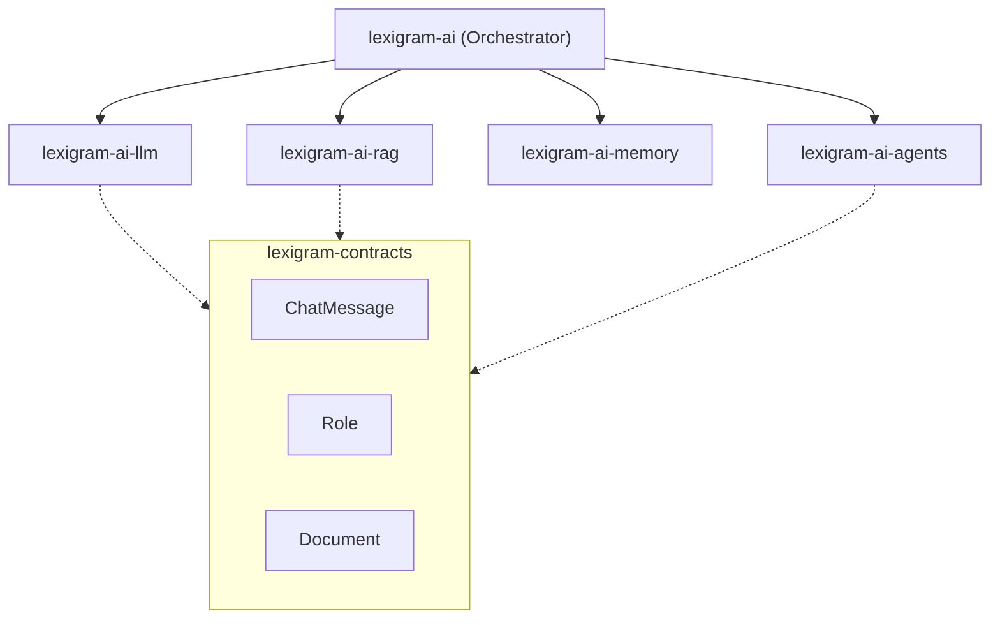

The Lexigram AI subsystem provides a contract-first, provider-agnostic framework for building intelligent applications. It follows the same IoC discipline as the rest of the framework, ensuring that LLM clients, vector stores, and agent strategies are swappable and testable.

- 📦 **Package**: `lexigram-ai` (Orchestrator)
- 🚦 **Status**: Beta
- 🔑 **Config key**: `ai`

---

## 1. Principles

1. **Protocol-First**: All AI interactions go through standard protocols from `lexigram-contracts`.
2. **Modular Implementation**: Sub-packages like `lexigram-ai-llm` and `lexigram-ai-rag` are isolated and discoverable via entry points.
3. **Registry-Based**: LLM providers and embedding models are managed via a centralized registry.

---

## 2. Core Hierarchy



---

## 3. Shared Value Types

The AI ecosystem relies on immutable value types defined in `lexigram.contracts.ai`.

### ChatMessage
Represents a single message in a conversation.

```python
from lexigram.contracts.ai.llm import ChatMessage, Role

msg = ChatMessage(
    role=Role.USER,
    content="Hello, how do I use the Result pattern?",
    metadata={"tokens": 12}
)
```

### Role
Standard roles for multi-turn conversations.
- `SYSTEM`: Instructions for the model.
- `USER`: Input from the human.
- `ASSISTANT`: Response from the model.
- `TOOL`: Output from a function call.

---

## 4. Example Transformation

A simple "Completion to Result" flow:

```python
from lexigram.ai import AIClient

async def ask_geezmo(prompt: str) -> Result[str, AIError]:
    client = await container.resolve(AIClient)
    
    # AIClient returns a Result[Completion, AIError]
    return (
        await client.complete(prompt)
        .map(lambda c: c.text)
    )
```
